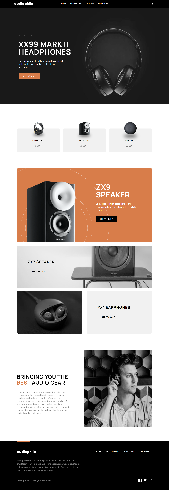

# Audiophile e-commerce website

This is a solution to the [Audiophile e-commerce website challenge on Frontend Mentor](https://www.frontendmentor.io/challenges/audiophile-ecommerce-website-C8cuSd_wx). Frontend Mentor challenges help you improve your coding skills by building realistic projects.

## Table of contents

- [Overview](#overview)
  - [The challenge](#the-challenge)
  - [Screenshot](#screenshot)
  - [Links](#links)
- [My process](#my-process)
  - [Built with](#built-with)
  - [What I learned](#what-i-learned)
  - [Continued development](#continued-development)
  - [Useful resources](#useful-resources)
- [Author](#author)

## Overview

### The challenge

Users should be able to:

- View the optimal layout for the app depending on their device's screen size
- See hover states for all interactive elements on the page
- Add/Remove products from the cart
- Edit product quantities in the cart
- Fill in all fields in the checkout
- Receive form validations if fields are missed or incorrect during checkout
- See correct checkout totals depending on the products in the cart
  - Shipping always adds $50 to the order
  - VAT is calculated as 20% of the product total, excluding shipping
- See an order confirmation modal after checking out with an order summary
- **Bonus**: Keep track of what's in the cart, even after refreshing the browser (`localStorage` could be used for this if you're not building out a full-stack app)

### Screenshot

#### Mobile view of App.


#### Tablet view of App.


#### Mobile view of App.


### Links

- Solution URL: [Add solution URL here](https://your-solution-url.com)
- Audiophile: [live site URL here](https://ecom-site-five.vercel.app/)

## My process

### Built with

- Semantic HTML5 markup
- Mobile-first workflow
- [React](https://reactjs.org/) - JS library
- [React-Router](https://reactrouter.com/en/main) - React Router a react library for routing
- [Tailwind-CSS](https://tailwindcss.com/docs) - Tailwind CSS
- [React-Hook-Form](https://react-hook-form.com/) - A library used for handling forms.
- [Redux](https://redux.js.org/) - Redux for global state management

### What I learned

I reinforced my knowledge about redux state management and learned how to use local storage for data persistence throughout browser sessions as seen below:

```js
// used during initial renders passing data if present to preloaded state and gives us initialState
const loadCartState = () => {
	try {
		const serializedState = localStorage.getItem("cart");
		if (serializedState === null) {
			return undefined;
		}
		const parsedState = JSON.parse(serializedState);

		// Ensure the state structure is correct
		if (
			parsedState &&
			Array.isArray(parsedState.items) &&
			typeof parsedState.numberOfItems === "number"
		) {
			return parsedState;
		} else {
			return undefined;
		}
	} catch (err) {
		return undefined;
	}
};

// this function is responsible for saving the cart to localStorage whenever the state changes
const saveCartState = (state) => {
	try {
		const serializedState = JSON.stringify(state.addToCart);
		localStorage.setItem('cart', serializedState);
	} catch(err) {
		console.log(err)
	}
};

const store = configureStore({
	reducer: {
		dropdown: dropdownReducer,
		addToCart: addToCartReducer,
		cartModal: cartModalReducer,
		confirmationModal: confirmationReducer,
		checkout: checkoutReducer
	},
	preloadedState : {
		addToCart: loadCartState(),
	},
});

store.subscribe(() => {
	saveCartState(store.getState());
})

export default store;

```

I also reinforced my knowledge on React Router and its uses for example the use of dynamic router to render different pages.

I learned how to use lighthouse to improve my SEO, accessibility and many other features of my webpage I used React helmet to make sure I had descriptive meta tags to improve my overall SEO for better ranking on google. Eg:

```JS
<Helmet>
				<title>{`${category} - Product Category`}</title>
				<meta
					name="description"
					content={`Explore our ${category} category to find a curated selection of new and featured products. Browse through our collection of ${category} items, each with detailed descriptions and high-quality images optimized for various devices. Discover the latest trends and styles, and click through to see individual products in detail. Shop now and enhance your experience with our diverse offerings!`}
				/>
</Helmet>
```

I learned how to use React hook forms and validation schemas along with yup for my form validation and handling look below at my validation schema for the checkout page where I used React hook forms register to handle forms:

```JS
	const validationSchema = yup
	.object({
		Name: yup.string().required("Missing name"),
		"Email Address": yup
			.string()
			.required("Missing email")
			.email("Invalid email format"),
		"Phone Number": yup.string().required("Missing phone number"),
		"Your Address": yup.string().required("Missing address"),
		"ZIP Code": yup.string().required("Missing ZIP Code"),
		City: yup.string().required("Missing city"),
		Country: yup.string().required("Missing country"),
		paymentMethod: yup.string().required("Select payment method"),
		"e-Money Number": yup.string().when("paymentMethod", {
			is: (value) => value === "e-Money",
			then: (schema) =>
				schema.required("enter e-Money number"),
		}),
		"e-Money PIN": yup.string().when("paymentMethod", {
			is: (value) => value === "e-Money",
			then: (schema) => schema.required("enter e-Money PIN"),
		}),
	})
	.required();
```

**update**

In this project, I optimized image loading by implementing `srcset` attributes for responsive images. This ensures that users on different devices (mobile, tablet, and desktop) receive appropriately sized images, reducing unnecessary data transfer and improving page load times. The `src` attribute is retained as a fallback to ensure compatibility across all browsers.

- **Preloading Critical Assets**: By preloading key images and other critical assets, I learned how to improve the Largest Contentful Paint (LCP) metric, which is crucial for a good user experience. Preloading ensures that important visual elements are available as soon as the page starts loading, reducing the time it takes for the largest visible content element to be rendered.

- **Understanding LCP**: LCP measures how quickly the main content of a page is rendered to the user, significantly affecting perceived performance. Optimizing LCP not only improves user satisfaction but also contributes to better SEO rankings, as LCP is a key metric in Google's Core Web Vitals.

These improvements have helped me enhance both the efficiency and the overall user experience of the website, ensuring that it loads quickly and performs well across all devices.

**update number 2**

though I did learn tcp this solution mentioned above ended up introducing bugs into my code and was not good at all I ended up resulting to dynamically changing the images with react. I am searching for another solution to this problem and will update in future.

### Continued development

IN future I would like to improve my websites performance in terms of using the threading of javascript. I realise some of my solutions are a bit verbose and I would like to in the future improve some of the code and refactor a more lightweight solution.

### Useful resources

- [React Hook Form video](https://youtu.be/LobZv3i6BXk?si=gIHQImqESfGXcebQ) - This video helped me learn how to use react hook form and build my validation schema.
- [Tailwind Docs](https://tailwindcss.com/docs) - This is the tailwind docs that helped me create the design design.
- [ChatGPT](chatgpt.com) - used to somewhat google and speed up my development process

## Author


- Website - [Add your name here](https://www.your-site.com)
- Frontend Mentor - [@Ckola99](https://www.frontendmentor.io/profile/Ckola99)
- Twitter - [Kola.Dev](https://www.twitter.com/KolaDev01)
